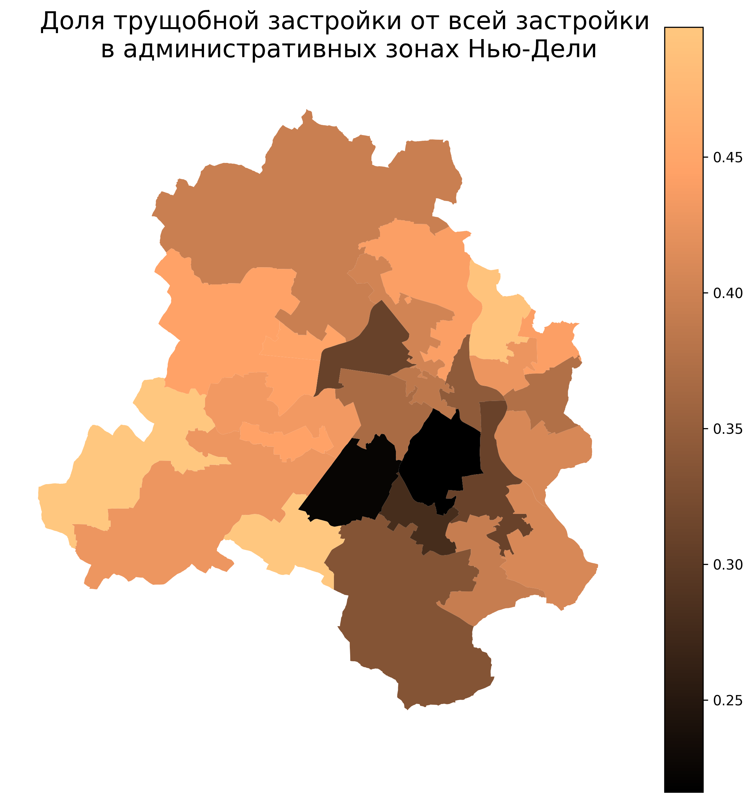

# Выделение трущобной застройки в трех городах Индии: Бангалоре, Мумбаи, Нью-Дели с помощью ML модели
Полученные результаты были агрегированы по районам

Модель обучалась трущобах Мумбаи, скаченных [отсюда](https://data.opencity.in/dataset/mumbai-slum-cluster-map). На всякий случай оставлю ссылку на [файл](https://drive.google.com/file/d/1hcOZ7Tk3SjpKFjH7SsWj8Cubq3sj7gNS/view?usp=sharing).

### Признаки 
рассчитывались на каждый тайл 250x250 м

- Индекс **NDVI** с разрешением 10 м (как правило у трущоб плотная застройка без растительности, низкие значения индекса укажут ее отсутсвие)
- Индекс **NDBI** с разрешением 10 м (индекс застройки, современная застройка дает более высокие значения, чем трущобы)
- Индекс **IBI** с разрешением 10 м (индекс застройки, «гасит» ложные срабатывания NDBI на голом грунте и воде)
- **GLCM** (Gray-Level Co-occurrence Matrix) с разрешением 10 м (это текстурный признак, который используется для анализа пространственной неоднородности изображений. Высокое значение этого признака указывает на хаотичную, «пёструю» сцену (типично для трущоб))
- **VIIRS Night-Lights** с разрешением 500 м (низкая освещённость → вероятная неформальная застройка)
- Количество зданий
- Медианная площадь зданий
- Доля домов, площадь которых меньше 40 м^2
- Доля площади застройки от тайла (250x250 м)

### Метрики
- **Accuracy**: 0.96
- **Precision**: 0.82
- **Recall**: 0.82
- **F1 Score**: 0.82
- **ROC AUC**: 0.90

### Полезные ссылки

**Снимки и индексы**:
- [Тут](https://drive.google.com/drive/folders/1rUfgtOlT86YXKSvNMUPA2LzRqndE1l9I?usp=sharing) лежат все нужные для модели спектральные индексы в формате .tif
- [Код](https://github.com/uroplatus666/slums/blob/master/for_GEE.js) для скачивания снимков Sentinel-2, индекса NDVI, NDBI и VIIRS Night-Lights для Бангалора, Мумбаи, Нью-Дели
- [Функция обрезки](https://github.com/uroplatus666/slums/blob/master/Features_prep.ipynb) снимков по маске городов
- Расчет IBI и GLCM для [Нью-Дели](https://github.com/uroplatus666/slums/blob/master/Delhi.ipynb), [Бангалора](https://github.com/uroplatus666/slums/blob/master/Bangalore.ipynb), [Мумбаи](https://github.com/uroplatus666/slums/blob/master/model_train_mumbai.ipynb)

**Здания**:
- Слои с застройкой были скачены с [microsoft](https://github.com/microsoft/GlobalMLBuildingFootprints/tree/main), данных там сильно больше, чем в OSM
- [Функция выгрузки](https://github.com/uroplatus666/slums/blob/master/downloading_jsons.ipynb) GeoJson файлов с домами на всю Индию, [алгоритм поиска](https://github.com/uroplatus666/slums/blob/master/jsons_finder.ipynb) нужных слоев
- [Обрезка](https://github.com/uroplatus666/slums/blob/master/Features_prep.ipynb) по маскам городов и добавление домов из OSM для Мумбаи, в местах отсутствия домов с microsoft
- Готовые обрезанные [слои](https://drive.google.com/drive/folders/1L2mQwBK6C0H6fDbUyJsoLJb91kYvo0Zl?usp=sharing) со зданиями на Бангалор, Мумбаи и Нью-Дели

**Модель**:
- [Обучение](https://github.com/uroplatus666/slums/blob/master/model_train_mumbai.ipynb) модели Random Forest и создание визуализации для Мумбаи
- [Сохраненная модель](https://drive.google.com/drive/folders/17ETUdznTL6kFhz-lSmefbYuHLNjRl2pz?usp=sharing) в формате pkl
- Предсказание трущобной застройки и созданием визуализации для [Бангалора](https://github.com/uroplatus666/slums/blob/master/Bangalore.ipynb) и [Нью-Дели](https://github.com/uroplatus666/slums/blob/master/Delhi.ipynb)

**Другое**:
- [Агрегированные данные](https://drive.google.com/drive/folders/1e8_a0pz8wQ8Ykb1OvuHSe4rEip4B53nX?usp=sharing) по тайлам 250x250 м
- [Агрегированные данные](https://drive.google.com/drive/folders/1RPS4GJBqTuIGpdgDG833XnPW-w5pznd5?usp=sharing) по административным зонам и округам, по микрорайонам
- [Границы](https://github.com/uroplatus666/slums/tree/master/%D0%93%D1%80%D0%B0%D0%BD%D0%B8%D1%86%D1%8B) городов, их административных зон, административных округов и микрорайонов

__________________________________________________
### [Визуализация](https://github.com/uroplatus666/slums/tree/master/%D0%98%D0%B7%D0%BE%D0%B1%D1%80%D0%B0%D0%B6%D0%B5%D0%BD%D0%B8%D1%8F) по административным зонам и округам, по микрорайонам Бангалор, Мумбаи и Нью-Дели, а также по тайлам 250x250

Несколько примеров:

    

    

    

    

    

